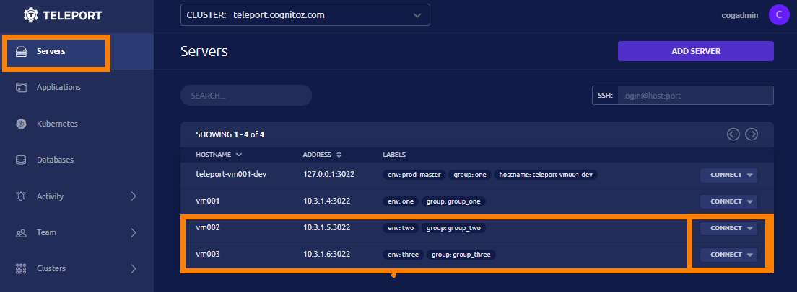
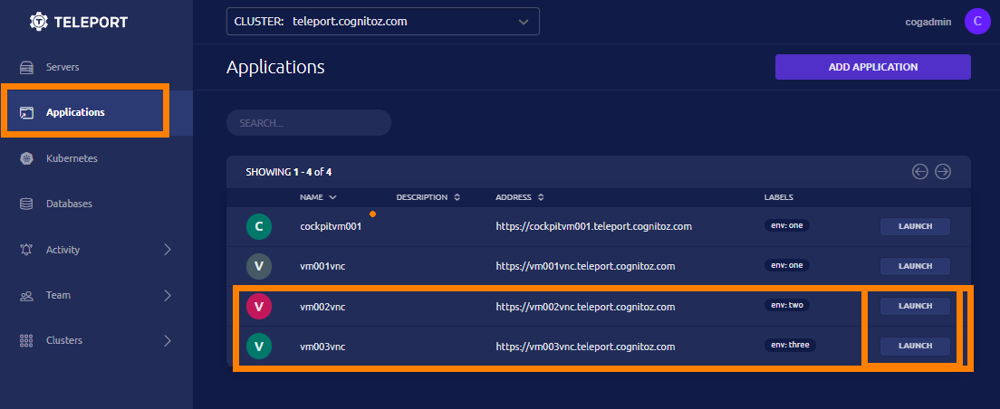

# Linux Bash shell script Assets

### Setup 

1. Access https://teleport.cognitoz.com/web/login  ( username  will be provided )

2. Access Shell / or VNC for GUI 

   * Shell Access 
     


   * VNC Desktop Access
     


3. Verify SElinux and Firewall are disabled 
    ```sh
    # firewall-cmd --list-all 
      FirewallD is not running

    # sestatus
      SELinux status: disabled
    ```
4. Verify podman container images available 
    ```sh 
    # podman images 

      REPOSITORY                     TAG      IMAGE ID       CREATED        SIZE
      docker.io/library/mysql        5.7      938b57d64674   2 weeks ago    454 MB
      docker.io/axiom/rsync-server   latest   7540e3def2fd   9 months ago   164 MB
      quay.io/stv707/oradb           12slim   27c9559d36ec   4 years ago    2.1 GB
    ```

5. Clone this repo 
    ```sh
    # cd ~
    # git clone https://github.com/stv707/shell_script.git 

    ```
6. System ready for Training Delivery

7. EBook can be downloaded at Cognitoz databin [ https://databin.cognitoz.com/s/b2b7GjnQFfVficU ]


- Assets used for Shell Script training
- smahalin@redhat.com